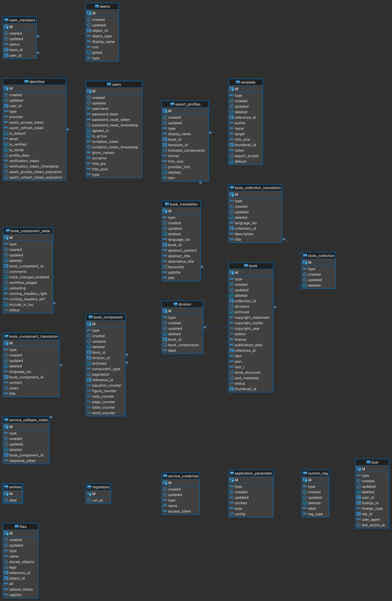

## Models

Ketty server includes the following models:

- **Application parameter**: Application-wide settings that are saved in the database.
- **Book**: The core entity in Ketida. Books consist of divisions (eg. “body”), and divisions consist of book components (eg. chapters).
- **BookCollection**: A collection of books (eg. “my books” in the dashboard). (One collection -> many books)
- **BookCollectionTranslation**: Translatable properties of a book collection (eg. the collection’s title might exist in both English and French). One book collection -> many book collection translations
- **BookComponent**: A manuscript, most often a chapter belonging to a division.
- **BookComponentState**: Some properties related to the current state of a book component (eg. the workflow states in Ketida v1).
- **BookComponentTranslation**: Translatable properties of a book component. One book component -> many book component translations
- **BookTranslation**: Translatable properties of a book. One book -> many book translations
- **CustomTag**: In Ketida client v1, wax allows you to create custom named annotations (tags). This table saves all the created custom tags.
- **DataLoader**: This is actually not a model, but related to the api and the controllers. It should be moved accordingly.
- **Division**: A collection of book components that exists inside a book. One book -> many divisions. One division -> many book components.
- **ExportProfile**: Each export profile is a collection of settings (for one book) that define what the exported book should be like: which template should be used, what is the target format, if it should include a TOC, if it has been synced with a provider (eg. Lulu) and more. One book -> many export profiles.
- **File**: An extension of coko server’s File model which adds relations and some helper methods (but no schema changes).
- **FileTranslation**: This doesn’t do anything anymore and should be deleted.
- **Lock**: A representation of the lock that is applied to a book component when a user is editing it.
- **ServiceCallbackToken**: This exists for xsweet specifically. The xsweet microservice has an option to be called asynchronously (ie. xsweet will receive the request, respond that it’s got it, and then send another request back when it’s done). When the initial call to xsweet is performed, a token is created and sent to the microservice. When the microservice responds, the token is sent back to ketida, so that it can be verified. This is done per request. When the response is finished (successfully or not), the row for the particular request is deleted.
- **ServiceCredential**: Same as Team. (see below)
- **Team**: This is just a re-export of coko server’s Team model. The folder exists only for some older migrations.
- **TeamMember**: Same as Team.
- **Template**: Exports (to pdf or epub) have an associated template with them. The template defines the styles, fonts and potentially also custom transformation scripts to be run. Templates can be used in multiple exports.
- **User**: Same as Team.

You can find the code for all models [here](https://gitlab.coko.foundation/ketty/server/-/tree/main/models?ref_type=heads).

## Entity Relation Diagram

