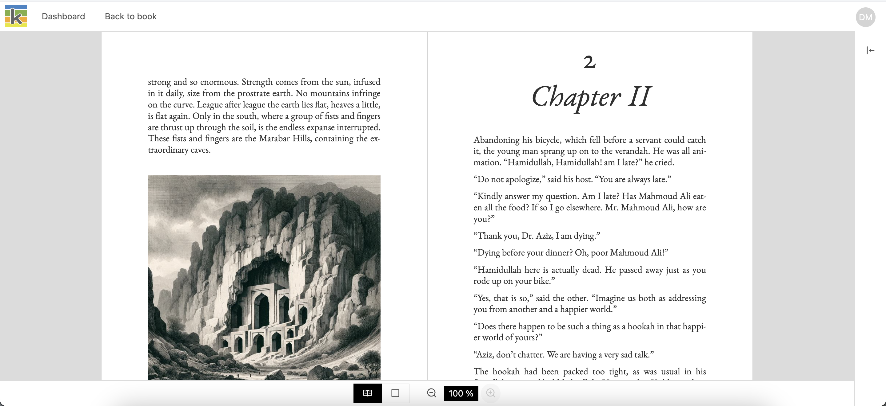
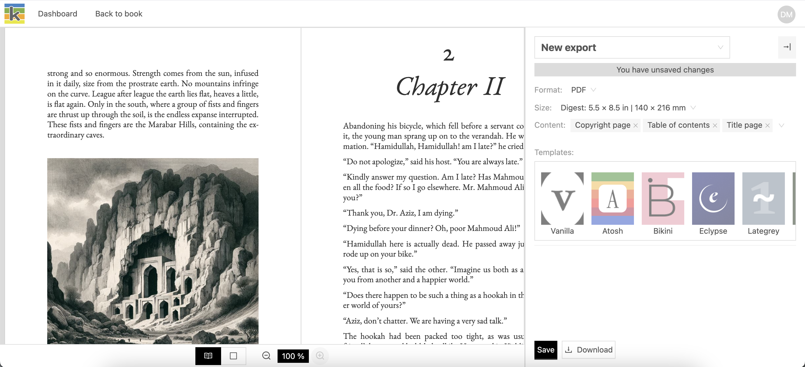

There are four primary interfaces in Ketty.

## Books Dashboard

The dashboard shows all of the books that you have created, as well as all of the books that you have access to as a collaborator. Books are shown in alphabetical order.

From the Books Dashboard you can:

- Create a book
- Delete a book
- Manage a book's cover.

Refer to the 'Books Dashboard' section of this guide for step-by-step guidance on these actions.

## The Producer

The Producer page is the primary space where you’ll work on your book's content and collaorate with others.

From the Producer page you can:

- Create new book parts and chapters
- Create a book's table of contents
- Write and edit the contents of a book
- Share a book with others
- Manage a book's metadata
- Set the AI-use for a book
- Access additional pages to preview and publish a book.

Refer to 'The Producer' section of this guide for step-by-step guidance on these actions.

## Preview and publish

The preview page shows the rendered output of your book and provides the next step actions to: 

- Change the layout template
- Download a PDF
- Download an epub
- Connent with a print-on-demand supplier.

Refer to the 'Preview and Publish' section of this guide for step-by-step guidance on these actions.

## Administration

The Administration page is available to users who have an admin role on a Ketty instance.

From the Administration page you can configure certain aspects of the instance.

Refer to the 'Administration' section of this guide for step-by-step guidance on these actions.

