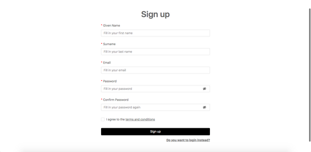
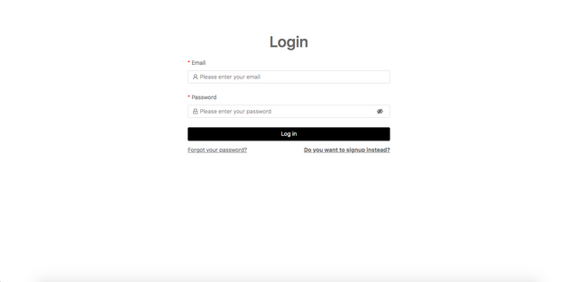
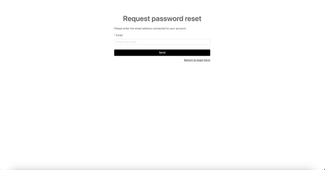

## Sign up

Your Ketty instance administrator will provide you with the URL to access Ketty. Anyone who wants to use Ketty must sign up by:

- providing basic information: name, email, password.
- accepting the terms and conditions (set by the instance administrator).
- verifying their email address by following the link emailed to the account provided.

## Log in

Once signed up, you can log in with the email and password you used to sign up.

## Reset Password

If you forgot your password, select ‘Forgot your password?’ from the Login page, enter the email associated with your account, and follow the instructions in the email.

## Logout

At any point, you can log out by selecting your username initials in the top right corner of the site, then select ‘Logout’.

