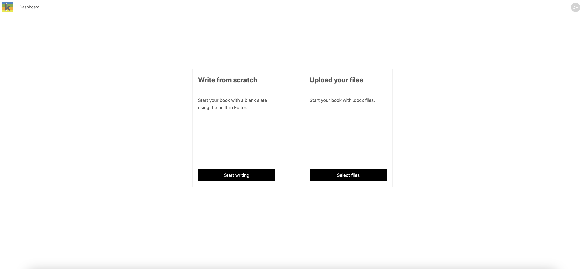

## Create a book

Select ‘New book’ from the Book Dashboard. There are two ways you can add content to a new book:

1. Write from scratch
2. Upload your files.

### Write from scratch

Type in your title, and click ‘Continue’. The title can be edited at a later stage in the book's metadata from the Producer page.

You'll land on the **Producer page** with a new chapter in view.

### Upload your files

‘Select files’ takes you to the Import page to upload one or many Word docx files. Each file you upload will be a separate chapter in your book.

After giving your book a title, You'll land on the Producer page. The files you uploaded will be displayed in the chapter list on the left once they are finished processing.

