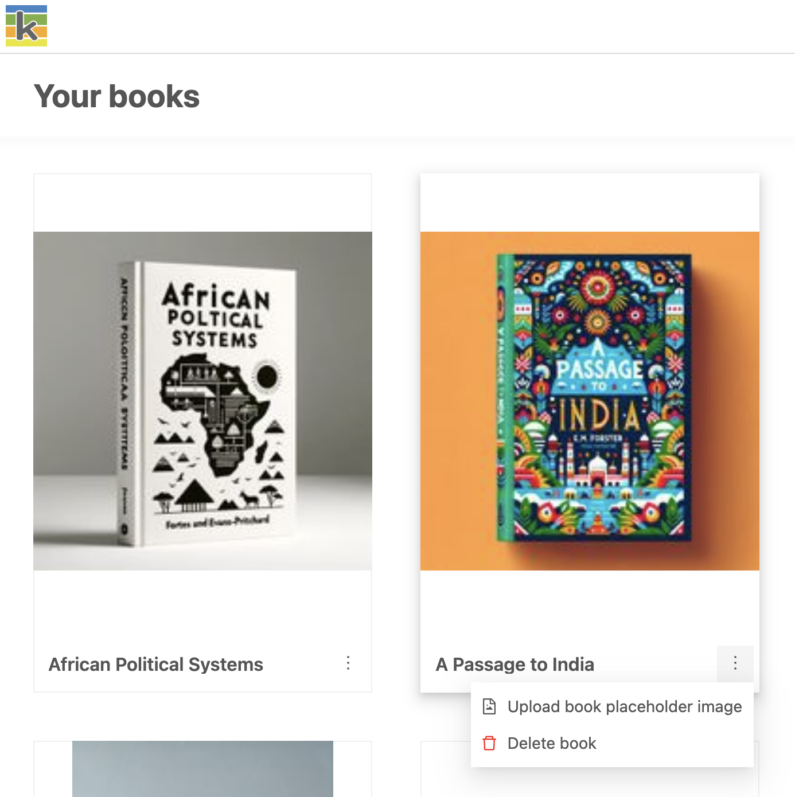

## Delete a book

The three dots next to each book’s name show a menu that includes the ability to delete a book. This action cannot be undone and can only be performed by the Book Owner (the user who created the book in Ketty).

