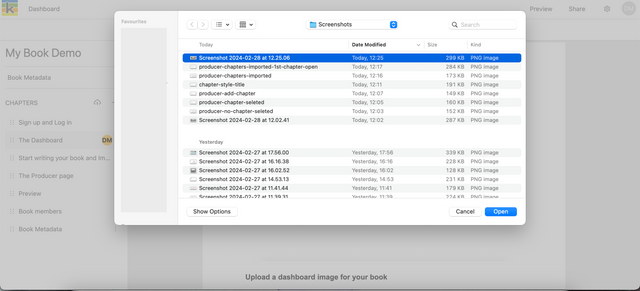
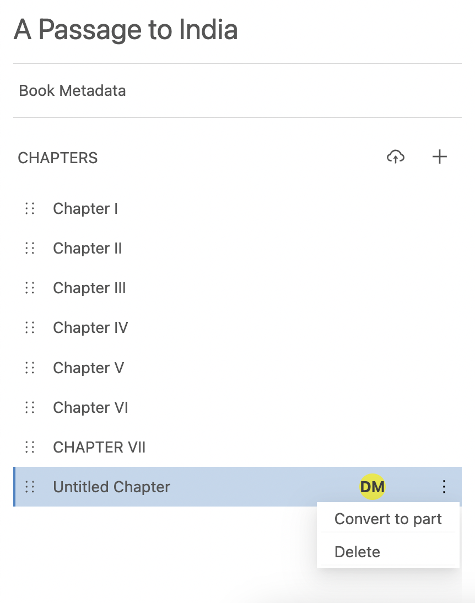
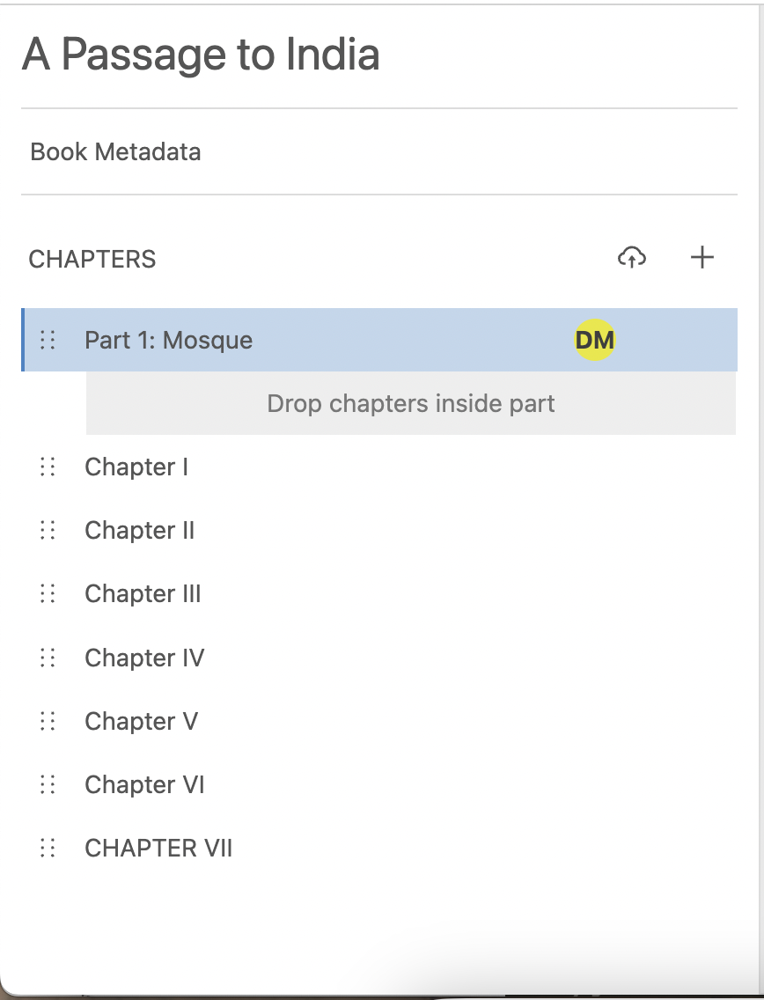
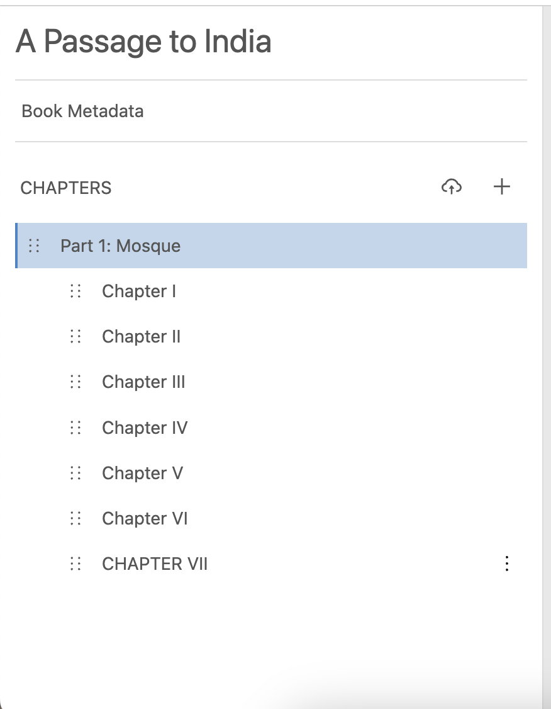

Ketty's book structure is completely flexible, allowing you to create and order your book components as needed.

## Create chapters

On the Producer page, you can add more chapters to your book by choosing to either create a new chapter or upload an existing chapter as a Word docx file.

Adding new chapters to your book:

- **Create a new chapter:** click the ‘+’ button in the chapter list on the left of the page.
- **Upload an existing chapter:** click the cloud upload icon from the left sidebar, and choose a docx file from your file browser. Your heading formatting and images from the uploaded document will be preserved.

## Create parts

Parts are a major division in a book used to arrange long works into logical divisions of a similar length. Parts have a common subject or theme.

To create a part in Ketty:

- Select the three horizonal dots on a chapter and 'Convert to part'
- Move the Part to its position in the table of contents
- Drag and drop the relevant chapters into the part.

