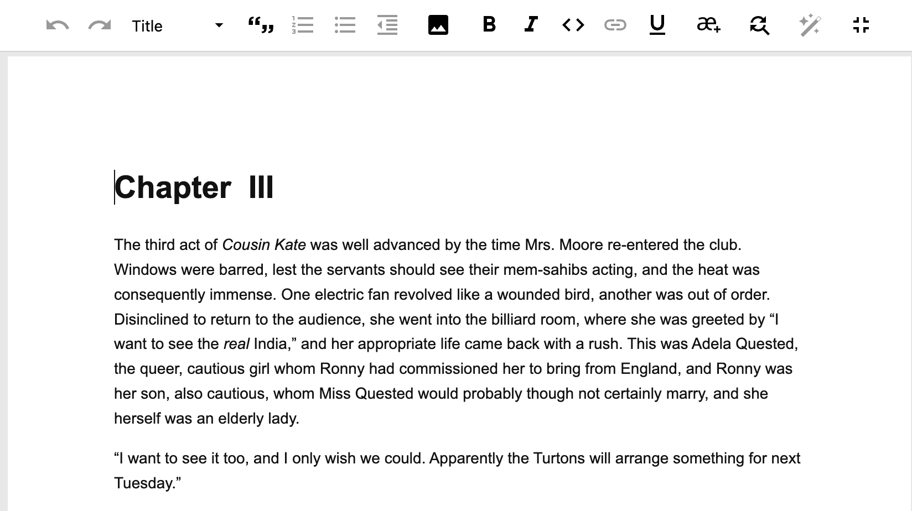

## Editing tools

Ketty's editor is a browser-based word processor which allows for a wide range of editing tools.

Formatting is applied to text by selecting the text, and then selecting the relevant tool from the toolbar.

In the toolbar the following tools are available (from left to right):

- **Undo (left arrow):** used to undo a change
- **Redo (right arrow):** used to redo a change that was undone
- **Text styles:** including heading levels (title, heading 2, heading 3) and paragraph text.
- **Blockquote:** indent text to show quoted text.
- **Ordered (numbered) list:** two levels of lists can be created. _Tip:_ to create a nested list, select the list item you want to nest, then click the ordered list button again.
- **Unordered (bulleted) list:** two levels of lists can be created. _Tip:_ to create a nested list, select the list item you want to nest, then click the ordered list button again.
- **Reduce indent:** to reduce or remove the indent on text (a blockquote) or list items.
- **Upload image:** to upload an image, place your cursor in the position you want the image to appear, and click the upload image icon.
- **Bold:** to apply bold to text
- **Italic:** to apply emphasis to text
- **Inline code** to apply style to lines of code so that it's differentiated from paragraph text. 
- **Hyperlink:** enter your link in the input field and click Apply. _Tip:_ links should be valid and include ‘https://’ to produce valid epubs.
- **Underline:** to apply underline to text
- **Special characters:** to insert a special character, place your cursor in the position you want it inserted, then click the special characters icon. Browse or search in the menu to find the character, then select it. The selected character will be inserted by your cursor.
- **Find and replace:** To find text in your chapter, click the find icon and enter the search item. Positive matches are shown in green in the text. You can cycle through results using the next and previous arrows. You can change case sensitivity using the \`Tt\` icon. To find and replace, click the three horizontal dots next to the find bar, enter the search item and the replace item, navigate to the result you want to replace using the previous and next arrows or choose to replace all. Select the Case Sensitive checkbox if your search should only match the case of the text input into the Find text input area. Replacement text will always use the exact case input into the ‘Replace text’ input area.
- **AI Assistant:** To use the prompt select some text in your chapter, then select the AI Assistant icon. This will show the prompt input area to type your prompt. After the response is generated, you can choose to ‘Replace selected text’, ‘Insert’ or ‘Discard’. See the ‘Write with AI assistance’ section for information on setting up AI use in your book.
- **Full-screen**: to enter full-screen mode, click this icon. To exit full-screen mode, click it again.

### Image support

Supported image files include JPEG, PNG, SVG, and TIFF. TIFF files are converted by Ketty to different formats for performance reasons, and in Epub and PDF exports the size optimised versions of an image are used. Once inserted, you can add a caption and alt text to the relevant input areas that appear below the image. To delete the image, double-click on it and hit backspace.
