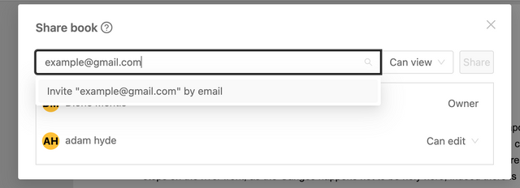
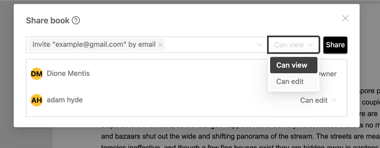
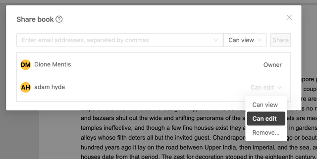
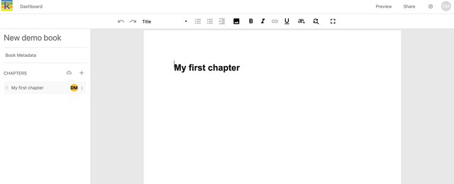

## Share your book with collaborators

In the top-right of the Producer page, you will find the ‘Share’ button, this will open the modal to add collaborators.

Only the **Book Owner** can manage book collaborators, other book collaborators can only view book permissions.

To add someone as a collaborator on your book:

- Enter the person’s email address.
- if the person has already signed up, you’ll see their name to select; alternatively, select the invite option.
- Choose the level of access that the person should have: _can edit_ or _can view_, then select ‘Share’. An email invitation will be sent to the person.

The Book Owner can change the type of access or remove a book collaborator using the dropdown next to the person’s name.

## Collaborators with edit access

Collaborators with _edit access_ can: 

* edit the book’s content and metadata
* make respond to comments
* view export previews
* download PDF or Epub files. 

### Collaborating with asynchronous editing

Ketty currently supports **asynchronous editing** on the individual chapter level. This means that only one person can edit a specific chapter at a time. This workflow is well-suited to teams who want to control their content creation and production in a step-by-step manner while still supporting open collaboration. 

Asynchronous editing in Ketty functions as follows:  

- One collaborator can edit a chapter at a time.
- Other collaborators can view a chapter that is currently being edited by other collaborator. 
- Other collaborators can make and respond to comments on a chapter that is currently being edited by other collaborator. 

To make this collaboration process clear, the chapter list shows who has edit access on a chapter at any one time by showing the user's initials next to the chapter name. We refer to this as a **chapter lock**. 

. 

To release a chapter lock: 

* Click on the chapter title that shows your initials. This will deselect the chapter and make it available for editing to all other collaborators with edit access.
* Alternatively, close the browser tab which has the chapter open. 

A chapter lock will automatically release if the chapter is open in a broswer tab and the tab is inactive for a 24-hour period. 

:::note

Refer to the [Locks](https://docs.ketty.community/docs/developerGuide/Locks) section of the Developer Guide for the techinical description.
:::

## Collaborators with view access

Collaborators with _view access_ can: 

* view the book’s content and metadata
* view export previews.

