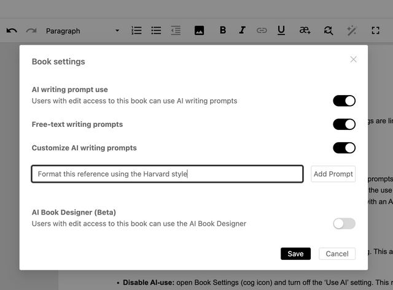

The **Book Owner** can control certain aspects of a book. Currently, the book settings are limited to managing AI use.

## AI assistance in books

### AI writing prompts

The Book Owner can choose when book collaborators with edit access can use AI prompts to assist their writing. The Book Owner can change the AI use per book at any time, making the use of AI prompts flexible yet controlled.

:::note

Your Ketty instance must be configured with an AI key on the Admin Dashboard before this functionality can be used.
:::

Setting AI-use from the Producer page of the book:

- **Enable AI-use:** open Book Settings (cog icon) and turn on the ‘AI writing prompt use’ setting. This adds the AI pen icon to the editor toolbar.
- **Disable AI-use:** open Book Settings (cog icon) and turn off the ‘AI writing prompt use’ setting. This removes the AI pen icon from the editor toolbar.

When AI writing prompts are enabled, the Book Owner can further customise their use by setting any number of custom prompts and optionally turning off free-text prompts.

### AI Book Desginer

The AI Book Designer is also enabled from book settings. Refer to the chapter ‘AI Book Designer (Beta) for further information.
