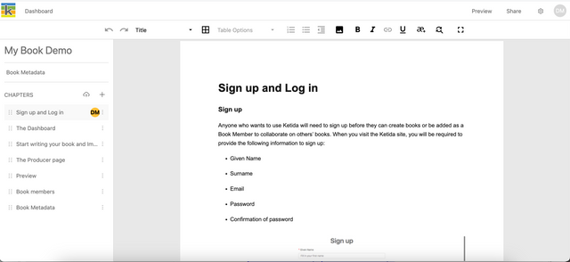

From the Producer page, you can access book metadata by clicking ‘Book Metadata’ in the left sidebar under the title of your book.

The information you provide in the Book Metadata modal will be used in auto-generated epub and PDF previews and exports.

## Title page

You can change the Title, Subtitle, and Authors.

## Copyright page

You can add multiple ISBNs to appear on your copyright page, each with its own label. This is useful when creating multiple different exports of your book which may require unique ISBNs.

You can also add copyright license information. Some license selections include sub-options to choose from.

When you are done inputting your metadata, click ‘Save’. You can return to the Book Metadata modal at any point to add or update book metadata information.
