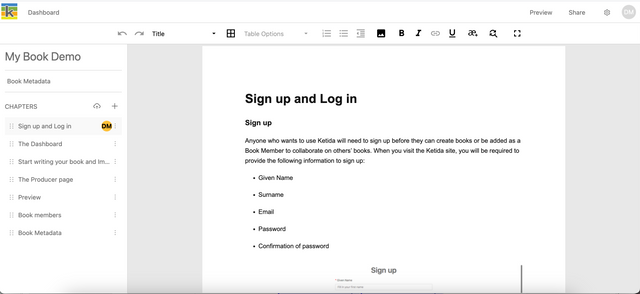
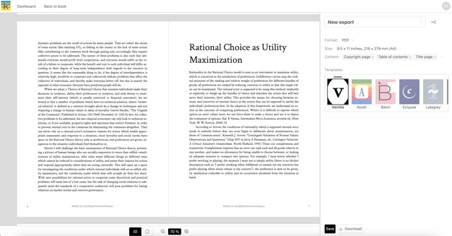
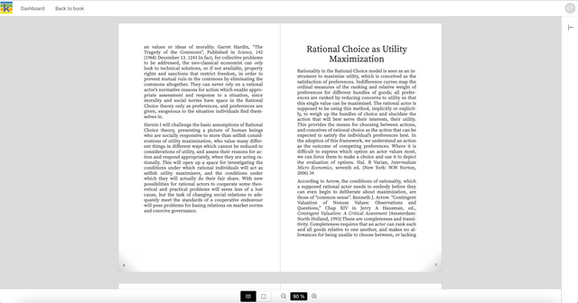

On the top right of the Producer page, you will see a Preview button. This button opens the Preview page.

At any point in your production process, you can view a PDF preview.

## PDF previews

When you first arrive on the Preview page you will see a default PDF preview. To change the default:

- Choose 'PDF'
- apply a page size
- select which front matter pages to include
- choose a design template.

When you change these settings the preview regenerates to apply your settings.

### PDF viewer controls

Controls at the bottom of the PDF preview allow you to change between single and double-page PDF views, and zoom in and out of your PDF. Note that zoom regenerates the preview so you have to scroll back to your page position.

To focus on your preview and hide the export sidebar, click the collapse icon on the top right of the export sidebar. To expand the export sidebar again, repeat the process.

## Epub previews

Epub preview is not currently available. Procced to export.
