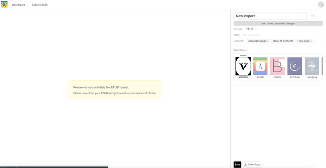

On the top right of the Producer page, you will see a Preview button. This button opens the Preview page.

At any point in your production process you can download the PDF and Epub exports of your book.

## PDF downloads

After selecting your chosen preview, download the PDF using the Download button at the bottom of the export sidebar.

## Epub download

To download an epub, Select ‘EPUB’ from the format dropdown, select the content you want to include and click ‘Download’. You can preview your epub in an epub reader of choice on your machine.

To assign a unique identifier to your epub, use the ISBN dropdown in the export sidebar to select one of the ISBNs that you added to your Book Metadata in the Producer Page.

