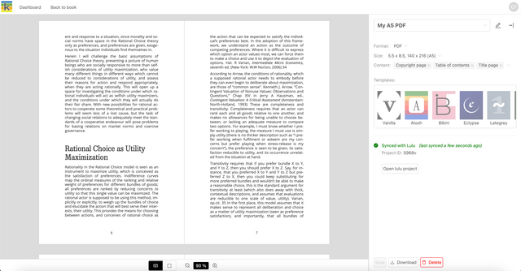

:::note
Only Book Owners can save export profiles or connect to print-on-demand services. 
:::

## Save a POD export configurations

When you have made any changes to the default preview configuration, you will see a ‘You have unsaved changes’ message. You need to save if you want to store your chosen configuration or connect to print-on-demand services.

When you click ‘Save’ you will be able to type in a name for your export configuration and click ‘OK’. You can create and store multiple export configurations, each for different export variations of a book.

## Connect to POD supplier

Once you have saved, you will be able to connect to a print-on-demand supplier (currently Lulu is supported) if this has been enabled in your instance of Ketty.

Once you choose ‘Connect to Lulu’ and log in to the print-on-demand supplier’s website, you are redirected back to Ketty to upload your export to that supplier.

Once uploaded, a message to indicate that the export has been synced successfully will appear. A button to open that export on the relevant supplier website will also appear.

## Sync changes with a POD supplier

Any changes made after syncing, for example to your book content, metadata, or export configuration, will result in an out-of-sync message being shown. At this point, you can choose to resync your export.

Once you choose to sync again, you will see confirmation that your version on Ketty and the version on the supplier’s site are in sync.

## Add additional POD export configurations

To create another export configuration, click on the current export name to access the dropdown of exports, and click ‘New export’. Follow the same process to create and save your export configuration, and connect to print-on-demand suppliers.

## Rename a POD export configuration

To change the name of an existing export, click the pen icon next to the export’s name, edit the name in the modal that appears, and click ‘OK’.

## Delete a POD export configuration

You can delete an export configuration at any time, by using the delete button at the bottom right of the export sidebar. Deleting an export configuration in Ketty will not delete the corresponding export on the print-on-demand supplier’s website, which needs to be done separately.
