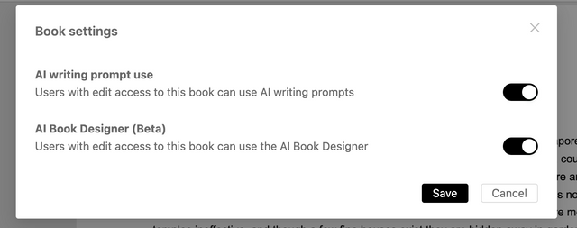
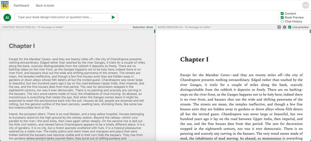
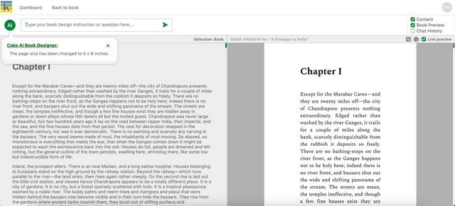

The Coko Foundation is leading the way in AI-assisted book design functionality with the beta release of the AI Book Designer in Ketty. This tool is the first of its kind to make PDF design interactive, intuitive, and instantaneously responsive to your commands. Imagine being able to click on any part of your document—titles, body text, images—and simply tell the AI what you want to change. Want to make the text green and bigger? Just say so, and it's done. This level of direct interaction and immediate feedback is unprecedented in document design software.

## Access the AI Book Designer

The Book Owner can choose when this beta feature can be used by going to the book’s settings.

- **Enable the AI Book Designer:** open Book Settings (cog icon) and turn on the ‘AI Book Designer (Beta)’ setting. This provides access to the page from the top navigation bar of your book.
- **Disable the AI Book Designer:** open Book Settings (cog icon) and turn off the ‘AI Book Designer (Beta)’ setting. This removes access to the page from the top navigation bar of your book.

## Overview of the AI Book Designer

The AI Book Designer has four main parts:

1.  The **prompt input** to type your book design instruction or question
2.  The **content selector** (left screen) to select the elements that you want to style
3.  The **book PDF preview** (right screen) shows the result of your prompt.
4.  The **chat history** that shows the history of prompts and responses for each selected element.

The content selector, book PDF preview, and chat history can be shown or hidden by using the checkboxes in the top right of the page.

## Use the AI Book Designer

Your design instructions or questions can relate to the entire book or specific elements of the book. Simply select the element in the content selector, insert your prompt, and see the result applied in the book PDF preview.

For example, in the image below, the user has selected the entire book and promoted the AI Book Designer to change the page size to 5 x 8 inches.

### Design capabilities

Keep in mind that this is a beta feature: some prompts may not work as expected and continuous improvement will be made. Here are some examples that will allow a wide variety of book designs:

- Change the font, type, size, and colour. For example: “Change all the headings colour to red”.
- Change page layout and size. For example: “Change the page size 5 x 8 inches”.
- Reduce the size of an image by a percentage value. For example: “Reduce this image by 20%”.
- Change text alignment: left, right, centered. For example: “Centre all the chapter headings”.

## Export the PDF

When you are satisfied with your book design you can export the PDF for sharing and printing. Simply select the printer icon in the top right of the book PDF preview.
