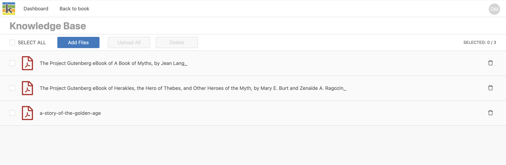
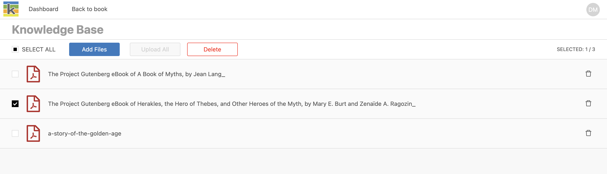
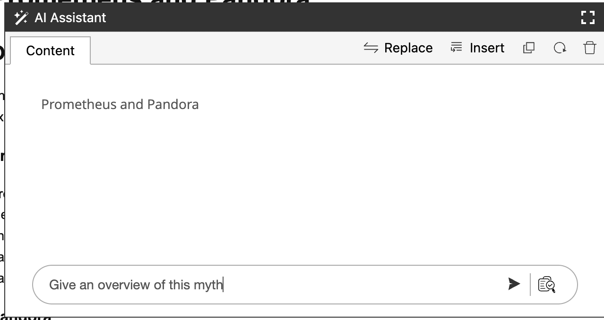
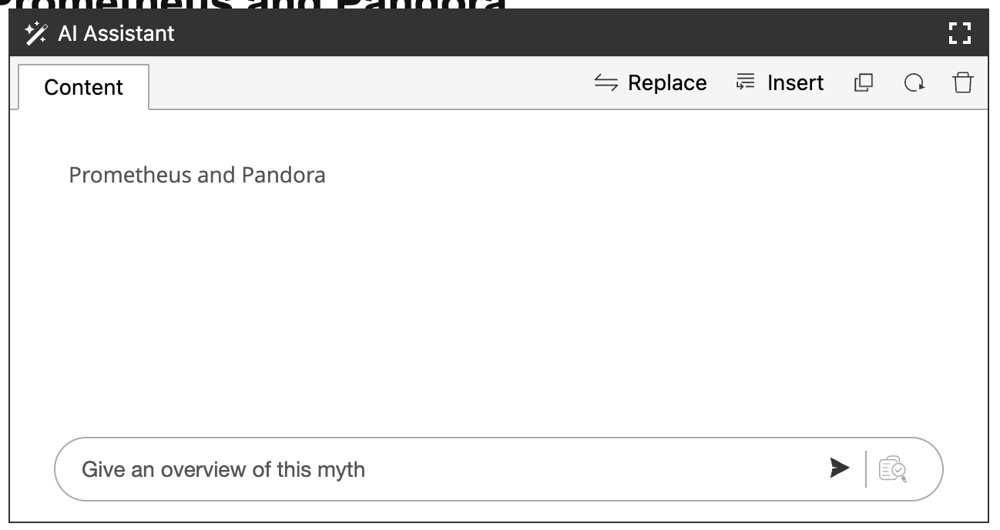
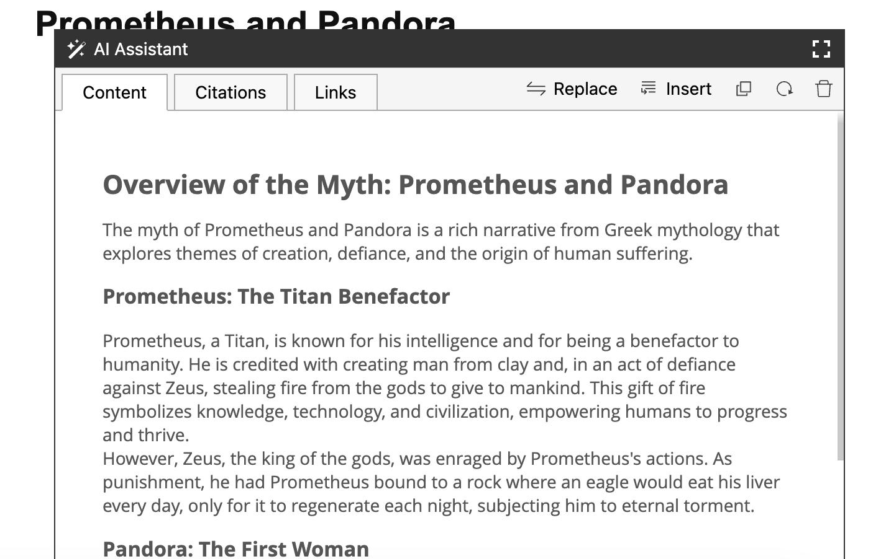

Writing with AI-assistance, for example using chatGTP, is extremely helpful. However, often in the writing process we need to give the AI-assistant a lot of context to get the most useful responses.

Ketty's built-in Knowledge Base (KB) simplifies this process by allowing users to associate a number of files to their book and then query this context with the AI-Assistant when writing.

Here's an overview of how it works:

- Users upload files to the KB
- Ketty breaks the files into smaller chucks for better searchability and creates an index
- When users make a query with a KB search enabled, the AI-Assistant uses the files in the KB as it's _preferential_ context and gives a response.

The sections below describe how to use the KB in more detail.

## Enable the Knowledge Base in a book

The Book Owner can enable the KB:

- From the Producer page, go to book settings
- In book settings, turn on the 'Knowledge Base' setting
- The Knowledge Base page is now accessible from the top navigation bar.

## Add files to the Knowledge Base

The Book Owner and collabrators with edit-acess can add files to the KB. From the Knowledge Base page:

- Select 'Add files' and choose the files from your computer. You may also drag and drop files into the files list area.
- Select 'Upload all' or upload individual files by selecting the upload icon to the right of the file title.
- The files will show an 'uploading' state until the upload is complete.

## Delete files from the Knowledge Base

The Book Owner and collabrators with edit-acess can delete files from the KB:

- To delete in bulk, check the 'Select all' box or check the relevant individual files in the file list, then select 'Delete'.
- To delete files one-by-one, select the delete icon to the right of the file title.

## Query the Knowledge Base

The Book Owner and collabrators with edit-acess can query the KB using the AI-assitant tool.

From the Producer page:

- Select some text in your chapter that you want to include in the KB query, and select the AI-assistant tool. 
- Optionally edit or add to the text you've selected in the 'Content' tab.

- Type your query in the promt area and press enter or select the 'Send' icon.

:::note

When the KB functionality is enabled in Book Settings, the AI-assistant will query the KB by default (as shown above). You can choose to _disable_ a KB search, when relevant, by disabling the 'Ask Knowelege Base' button, shown below.

:::

## Insert a response from the Knowedge Base

The response may include the following:
  - 'Content' tab: the response text from the query.
  - 'Citations' tab: any relevant citations that may be present in the searched files, and the filename that was queried in the KB.
  - 'Links' tab: any relevant links that may present in the searched files.

:::tip

The insert or copy action applies to the text in the 'Content' tab. If you'd like to include the citations or links in your chapter, first copy this text in the 'Content' tab. 
:::

## Improve a response from the Knowedge Base

The response in the 'Content' tab is editable, so you can choose to iterate in this text until you're satified with it, before using the insert action. 

For example, you could: 

* edit a the response text
* make another query such as 'summarise this information into bullet points'. 

Alternatively, you could insert the first response into your chapter and iterate on indivdual sections but selecting the relevant text and uing the AI assistant tool again.