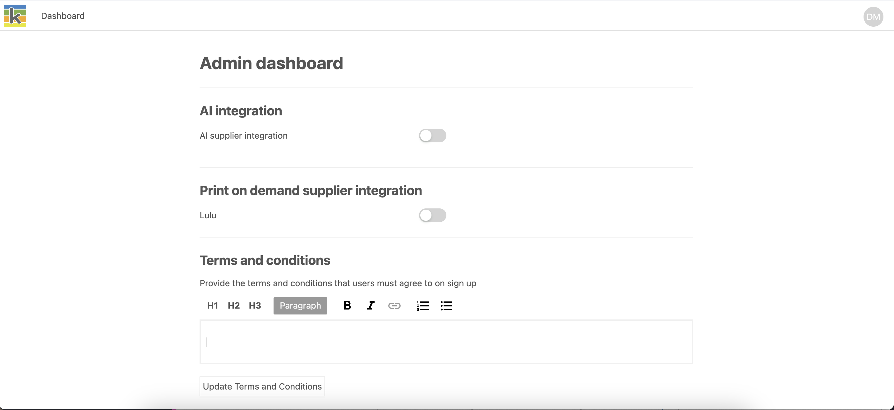

:::note

An administrator user should be set when a Ketty instance is first deployed and more admins can be added at any time. Speak to your hosting provider about configuring admin access.
:::

To access the **Admin Dashboard**, select your initials in the top-right of the navigation bar, then select ‘Admin’.

Currently, the Admin Dashboard supports three instance configurations. Further administration features will be added in future releases of Ketty.

## AI Integration

Ketty provides an AI writing assistant and AI Book Designer (Beta). To access and use this functionality a Ketty instance must first be set up with an AI key. Currently, Ketty supports OpenAI API keys. This feature can be enabled or disabled at any time.

## Print-On-Demand Integration

Ketty can be integrated with Print-on-demand suppliers so that you can order your printed book directly from the application. Currently, Ketty integrates with [Lulu](https://www.lulu.com/), which enables Book Owners to publish, print, and sell their books internationally with Lulu’s Print-on-demand network. This feature can be enabled or disabled at any time.

When an Admin has turned on ‘Lulu’ this gives Book Owners the ability to sync their Ketty account with their Lulu account.

## Sign-up Terms and Conditions

Administrators of a Ketty instance may choose to set terms and conditions for its use which users are required to accept on sign-up. By default, the sign-up terms and conditions are blank. To set the custom terms and conditions for the instance, simply input them into the provided editor and select 'Update Terms and Conditions' to save your changes.

